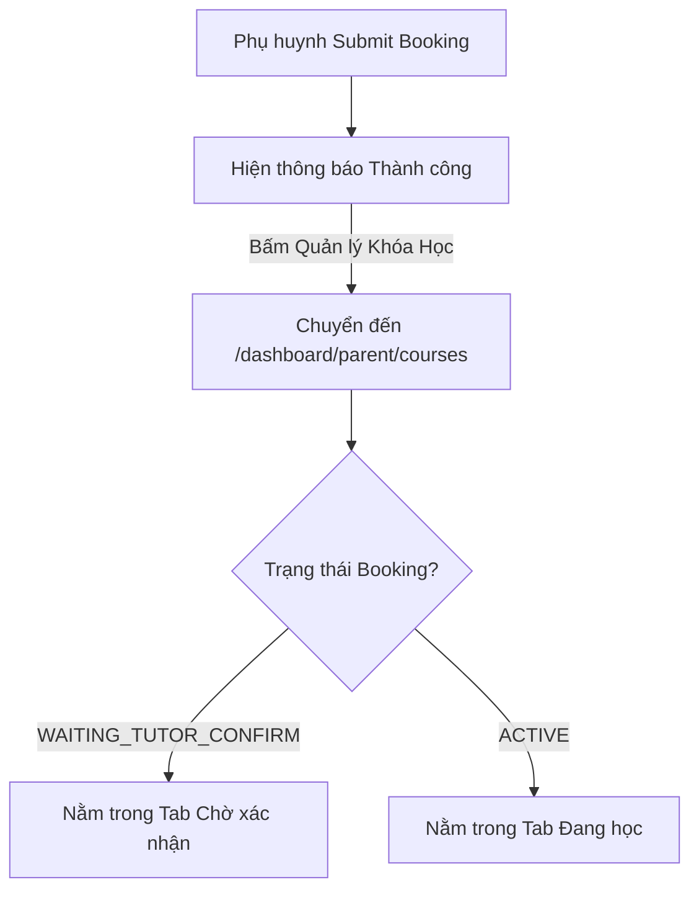

# Spec: Post-Booking Flow & Tracking

## 1. Executive Summary
Tối ưu điểm chạm cuối cùng của quá trình tạo Đặt lịch (Booking). Điều hướng Phụ huynh về đúng trang quản lý Khóa Học thay vì Lịch Học (nhằm tránh cảm giác trống rỗng), đồng thời nâng cấp trải nghiệm quản lý khóa học bằng cách chia Tab hiển thị rõ ràng các Booking đang chờ Gia sư xác nhận.

## 2. User Stories
- **Là một Phụ huynh:** Sau khi đặt lịch xong, tôi muốn bấm Xem Khóa Học để thấy ngay yêu cầu của tôi đang ở trạng thái Cần duyệt.
- **Là một Phụ huynh:** Tôi muốn quản lý riêng Khóa học Đang học và Khóa học Chờ xác nhận để phân biệt rõ ràng.
- **Là một Phụ huynh:** Khi tôi lỡ vào trang Lịch Học trong lúc chưa có gì, tôi muốn thấy một dòng chữ báo hiệu rằng lịch học sẽ có mặt sau khi Gia sư duyệt hợp đồng.

## 3. UI Components & Changes
- **Booking Success Page (`/tutor/[slug]/booking/page.tsx`):** Đổi nút "XEM LỊCH HỌC" thành "QUẢN LÝ KHÓA HỌC" cùng đường dẫn `/dashboard/parent/courses`.
- **Parent Courses Page (`/parent/courses/page.tsx`):** Chia giao diện thành 2 Tabs (ví dụ: "Tất cả / Đang học" & "Chờ duyệt"). Booking ở trạng thái `WAITING_TUTOR_CONFIRM` sẽ được đưa vào Tab Chờ duyệt.
- **Parent Schedules Page (`/parent/schedules/page.tsx`):** Cập nhật Empty State giải thích rõ ràng nếu trống.

## 4. Logic Flowchart

